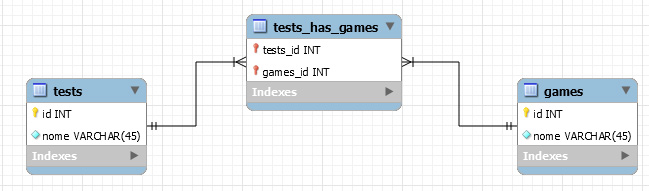

# Tutoriais

### Working with relational removals by yii2

This tutorial shows you how to safely and safely remove relationships between relationships and multiple lines.

First we create three tables using a Many to Many relationship.


** Important: Apply cascate to foreign key, update and Delete. **

This feature will allow you to remove the foreign keys along with the line you want to delete. This is very useful not to pollute your code.

Script Sql the ralation has.

```Sql
CREATE TABLE `tests_has_games` (
   `tests_id` int(11) NOT NULL,
   `games_id` int(11) NOT NULL,
   PRIMARY KEY (`tests_id`,`games_id`),
   KEY `fk_tests_has_games_games1_idx` (`games_id`),
   KEY `fk_tests_has_games_tests_idx` (`tests_id`),
   CONSTRAINT `fk_tests_has_games_games1` FOREIGN KEY (`games_id`) REFERENCES `games` (`id`) ON DELETE CASCADE ON UPDATE CASCADE,
   CONSTRAINT `fk_tests_has_games_tests` FOREIGN KEY (`tests_id`) REFERENCES `tests` (`id`) ON DELETE CASCADE ON UPDATE CASCADE
 ) ENGINE=InnoDB DEFAULT CHARSET=utf8 COLLATE=utf8_bin

```

* Step 2: Create models: (to use generator gii, this system create model with relations of the table).

** ModelGames: **

```php
public function getTestsHasGames()
    {
        return $this->hasMany(TestsHasGames::className(), ['games_id' => 'id']);
    }

    /**
     * @return \yii\db\ActiveQuery
     */
    public function getTests()
    {
        return $this->hasMany(Tests::className(), ['id' => 'tests_id'])->viaTable('{{%tests_has_games}}', ['games_id' => 'id']);
    }

```

** Model Tests: **

```php
public function getTestsHasGames()
    {
        return $this->hasMany(TestsHasGames::className(), ['tests_id' => 'id']);
    }

    /**
     * @return \yii\db\ActiveQuery
     */
    public function getGames()
    {
        return $this->hasMany(Games::className(), ['id' => 'games_id'])->viaTable('{{%tests_has_games}}', ['tests_id' => 'id']);
    }

````

* Step 3: Simple Removal Functions in controllers:

```php
public function actionDeletarTest($id)
  {

    $session = \Yii::$app->session;

    $testes = Tests::findOne($id);

    if($testes->delete())
    {
      $session->addFlash('resposta', [
        'type'=>'success',
        'msg'=>'Teste deletado com sucesso.'
      ]);
    }else{
      $session->addFlash('resposta', [
        'type'=>'danger',
        'msg'=>'Erro encontrado favor resolver.'
      ]);
    }

    return $this->redirect(['site/delete-relations']);

  }

```

* Other Methods

```php


public function actionDeleteListGames()
  {
    $array_id = [1,2,3,4];

    $games = Games::find()->where(['in','id',$array_id])->all();

    foreach($games as $k => $game)
    {
      $game->delete();
    }

  }


public function actionDeleteTheRelation($id)
  {


    $game = Games::find()->joinWith(['tests'=>function($q){
      return $q->where(['like','nome','proccess'])
    }])->where(['id'=>$id])->one();

    foreach($games->tests as $k => $test)
    {
      $test->delete();
    }

  }

```

** All code in this post **

@author André Luiz Pereira
Link: https://www.facebook.com/androidemastercode/
